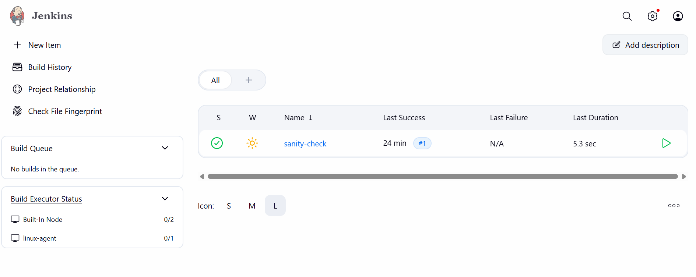
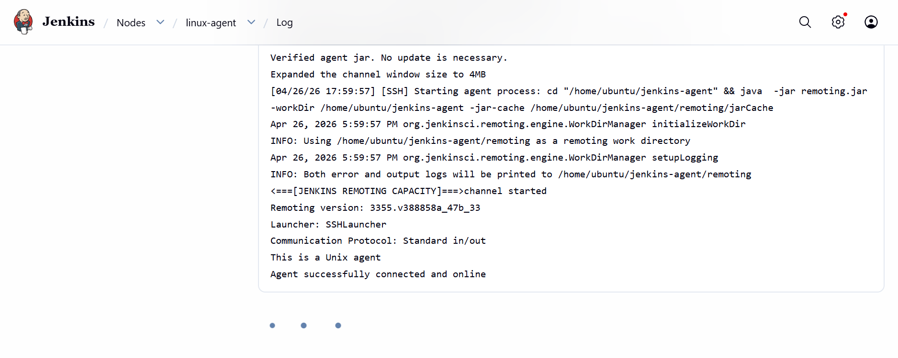
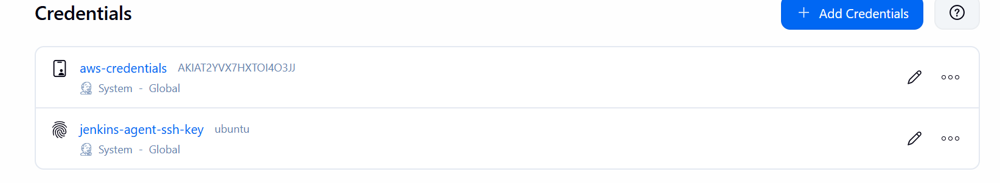
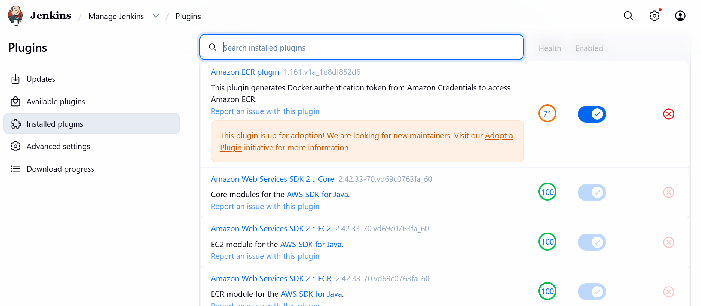
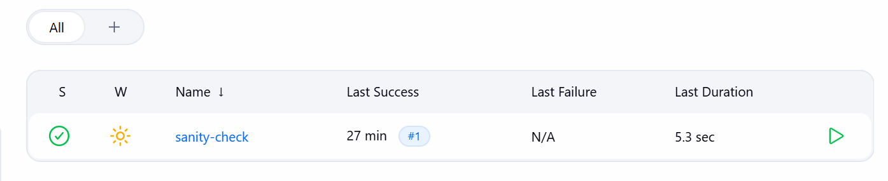

# DevOps Assignment 4 — CI/CD Pipeline Report

## Architecture Diagram

```
┌─────────────────────────────────────────────────────────────────────────────┐
│                              AWS VPC (10.0.0.0/16)                         │
│                                                                             │
│  ┌─── Public Subnet (10.0.1.0/24) ──────────────────────────────────────┐  │
│  │                                                                       │  │
│  │  ┌──────────────┐   ┌──────────────┐   ┌──────────────────────────┐  │  │
│  │  │   Jenkins     │   │  SonarQube   │   │  Application Load       │  │  │
│  │  │   Controller  │   │  Server      │   │  Balancer (ALB)         │  │  │
│  │  │   :8080       │   │  :9000       │   │  :80 (prod) :8081 (test)│  │  │
│  │  └──────┬───────┘   └──────────────┘   └──────┬──────┬───────────┘  │  │
│  │         │                                      │      │              │  │
│  │         │ SSH                            ┌─────┘      └─────┐       │  │
│  │         │                                ▼                  ▼       │  │
│  │         │                         ┌──────────┐       ┌──────────┐  │  │
│  │         │                         │ tg-blue  │       │ tg-green │  │  │
│  │         │                         │ (ASG)    │       │ (ASG)    │  │  │
│  │         │                         └──────────┘       └──────────┘  │  │
│  └─────────┼─────────────────────────────────────────────────────────┘  │
│            │                                                             │
│  ┌─── Private Subnet (10.0.10.0/24) ────────────────────────────────┐  │
│  │         ▼                                                         │  │
│  │  ┌──────────────┐                                                │  │
│  │  │   Jenkins     │──── Builds ──→ Docker Image ──→ AWS ECR       │  │
│  │  │   Agent       │                                                │  │
│  │  │ (linux-agent) │──── Scans ──→ Trivy / tfsec                   │  │
│  │  └──────────────┘                                                │  │
│  └──────────────────────────────────────────────────────────────────┘  │
│                                                                         │
│  ┌─── S3 Backend ───────────────────────────────────────────────────┐  │
│  │  terraform.tfstate + DynamoDB Lock + Deployment Log              │  │
│  └──────────────────────────────────────────────────────────────────┘  │
└─────────────────────────────────────────────────────────────────────────┘

Commit Flow:
  Developer → GitHub Push → Webhook → Jenkins Controller → Agent Builds
  → SonarQube Analysis → Docker Build → Trivy Scan → ECR Push
  → Blue-Green Deploy → ALB Switch → Production
```

---

## Task 1: Jenkins Installation and Basic Configuration

### 1.1 Infrastructure Provisioning

The Jenkins controller and agent are provisioned using Terraform on EC2 instances inside the VPC from Assignment 3.

- **Controller**: `t3.medium` in public subnet, ports 8080 (Jenkins UI) and 22 (SSH) restricted to my IP
- **Agent**: `t3.medium` in private subnet, SSH access only from controller's security group

**Terraform files**: `jenkins/terraform/main.tf`

```bash
cd jenkins/terraform
terraform init
terraform plan
terraform apply
```

### 1.2 Software Installation (via user_data)

The `user_data` script installs: Java 17, Jenkins LTS, Git, Docker, AWS CLI v2, Terraform, Node.js 18, Trivy, and tfsec.

### 1.3 Initial Setup

1. Access Jenkins at `http://<CONTROLLER_IP>:8080`
2. Unlock with initial admin password from `/var/lib/jenkins/secrets/initialAdminPassword`
3. Created admin user (replaced default password)
4. Installed suggested plugins + required plugins

### 1.4 Required Plugins Installed

| Plugin | Purpose |
|--------|---------|
| Pipeline | Declarative/Scripted pipelines |
| Git | Git SCM integration |
| GitHub Branch Source | Multibranch pipeline discovery |
| Docker Pipeline | Docker build steps |
| Credentials Binding | Inject secrets safely |
| Pipeline Utility Steps | readJSON, writeFile, etc. |
| SonarQube Scanner | Code quality analysis |
| Blue Ocean | Pipeline visualization |

### 1.5 Build Agent Configuration

- **Name**: `linux-agent`
- **Labels**: `linux-agent`
- **Launch method**: SSH
- **Remote root**: `/home/ubuntu/jenkins-agent`
- Connected via SSH key from controller to agent's private IP

### 1.6 Jenkins Credentials

| ID | Type | Purpose |
|----|------|---------|
| `aws-credentials` | AWS Access Key | AWS API access |
| `github-pat` | Secret text | GitHub PAT for repo access |
| `sonarqube-token` | Secret text | SonarQube project token |
| `ecr-credentials` | Username/Password | ECR authentication |
| `slack-webhook-url` | Secret text | Slack notifications |
| `jenkins-agent-ssh` | SSH Key | Agent SSH connection |

### 1.7 Sanity Check

Created a Pipeline job using `pipelines/Jenkinsfile.sanity` that runs `echo hello` on the agent — **passed successfully**.

**Deliverable screenshots needed:**






---

## Task 2: Declarative Pipeline with Parallel Stages and Notifications

### 2.1 Sample Application

Built a **Node.js Express REST API** (`app/`) with:
- `/health` endpoint — returns health status, uptime, hostname
- `/api/items` CRUD endpoints — full REST operations
- Input validation, error handling, CORS, Helmet security

### 2.2 Test Suite

| Type | Count | File |
|------|-------|------|
| Unit tests | 8 | `tests/unit/app.test.js` |
| Integration tests | 8 | `tests/integration/app.integration.test.js` |
| **Total** | **16** | Exceeds required 5+2 |

### 2.3 Jenkinsfile Structure

```
Checkout → Build → Static Analysis → Quality Gate → Test (parallel) → Container Build → Security Scan → Push to ECR → Deploy Production
```

### 2.4 Parallel Test Stage

The Test stage runs Unit Tests and Integration Tests concurrently using a `parallel` block. Each branch publishes its JUnit test report independently.

### 2.5 Pipeline Configuration

- **Agent**: `linux-agent` label
- **Environment**: Uses `credentials('slack-webhook-url')` to inject secrets
- **Post section**: `always` (archive artifacts), `success` (Slack notification), `failure` (Slack with failing stage name)
- **Multibranch Pipeline**: Configured with GitHub Branch Source for automatic branch/PR discovery
- **GitHub Webhook**: Configured to trigger builds on push

**Deliverable screenshots needed:**
- [ ] Blue Ocean visualization of successful pipeline
- [ ] Parallel stage view inside Test stage
- [ ] JUnit test report page
- [ ] Slack messages (success + failure)
- [ ] GitHub webhook configuration
- [ ] PR build with Jenkins status check

---

## Task 3: Reusable Jenkins Shared Library in Groovy

### 3.1 Library Structure

Repository: `jenkins-shared-library` (separate GitHub repo)

```
shared-library/
├── vars/
│   ├── notifySlack.groovy       # Send Slack notifications
│   ├── buildAndPushImage.groovy  # Build & push Docker images
│   └── runSonarScan.groovy       # SonarQube analysis + gate
└── src/org/devops/
    ├── NotificationService.groovy # Slack + Email class
    └── DockerHelper.groovy        # Docker build/push class
```

### 3.2 Groovy Classes (src/)

**NotificationService**: OOP class with `sendSlack(message, channel, color)` and `sendEmail(to, subject, body)` methods. Constructor receives the Jenkins script object.

**DockerHelper**: OOP class with `buildImage(name, tag)`, `pushImage(name, tag, registry)`, and `loginECR(region, accountId)` methods.

### 3.3 Global Variables (vars/)

All accept a `Map` of parameters and validate required keys:
- **notifySlack**: Requires `message`, optional `channel` and `color`
- **buildAndPushImage**: Requires `name`, `tag`, `region`, `accountId`
- **runSonarScan**: Requires `projectKey`, `sources`, optional `waitForGate`

### 3.4 Jenkinsfile Refactoring

**Before** (direct Slack call in post):
```groovy
post {
    success {
        sh "curl -X POST -H 'Content-type: application/json' --data '...' \$SLACK_WEBHOOK"
    }
}
```

**After** (using shared library):
```groovy
@Library('devops-shared-library') _

post {
    success {
        notifySlack([
            message: "✅ Build #${env.BUILD_NUMBER} SUCCEEDED",
            channel: '#devops-builds',
            color: 'good'
        ])
    }
}
```

**Deliverable screenshots needed:**
- [ ] Library registered in Manage Jenkins → System
- [ ] Build log showing "Loading library devops-shared-library@main"
- [ ] Before/after diff of Jenkinsfile

---

## Task 4: Code Quality with SonarQube Integration

### 4.1 SonarQube Server

- Deployed on `t3.small` EC2 instance via Docker Compose
- Port 9000 restricted to my IP and Jenkins agent SG
- Embedded H2 database (acceptable for this assignment)

### 4.2 Jenkins Configuration

- Generated SonarQube project token → added as `sonarqube-token` credential
- Registered server under Manage Jenkins → System → SonarQube servers
- Configured SonarQube webhook pointing back to Jenkins for Quality Gate

### 4.3 Pipeline Integration

The **Static Analysis** stage runs `sonar-scanner` with `withSonarQubeEnv`:
```groovy
stage('Static Analysis') {
    steps {
        withSonarQubeEnv('SonarQube') {
            sh 'sonar-scanner ...'
        }
    }
}
```

The **Quality Gate** stage uses `waitForQualityGate`:
```groovy
stage('Quality Gate') {
    steps {
        timeout(time: 5, unit: 'MINUTES') {
            waitForQualityGate abortPipeline: true
        }
    }
}
```

### 4.4 Quality Gate Configuration

Using **Sonar way** Quality Gate with tightened condition:
- Coverage on New Code ≥ **70%**

### 4.5 Code Coverage

Using **Jest** with `--coverage` flag, generating LCOV reports passed to SonarQube via:
```
-Dsonar.javascript.lcov.reportPaths=coverage/lcov.info
```

**Deliverable screenshots needed:**
- [ ] SonarQube dashboard (Reliability, Security, Maintainability, Coverage)
- [ ] Quality Gate configuration with edited coverage condition
- [ ] Console log: waitForQualityGate returning OK
- [ ] Quality Gate failure (intentionally lowered coverage)

---

## Task 5: Docker Build, Vulnerability Scanning, and ECR Push

### 5.1 Multi-Stage Dockerfile

```dockerfile
# Stage 1: Builder — installs dependencies
FROM node:18-alpine AS builder
...
RUN npm ci --only=production

# Stage 2: Runtime — minimal, non-root
FROM node:18-alpine AS runtime
RUN adduser -S appuser ...
USER appuser
```

Key features:
- **Two stages**: builder (installs deps) → runtime (minimal image)
- **Non-root user**: `appuser` (UID 1001)
- **No build tools** in final image
- **Health check** built into the image

### 5.2 Image Tagging

Two tags per build:
- **Git commit SHA**: `devops-sample-app:a1b2c3d`
- **Branch name**: `devops-sample-app:main`

### 5.3 AWS ECR Repository

Provisioned via Terraform (`terraform/ecr.tf`):
- **Lifecycle policy**: Keep 10 most recent images, expire untagged after 7 days
- **Image scanning**: Enabled on push

### 5.4 ECR Authentication

Using **IAM role** attached to the Jenkins agent EC2 instance — no long-lived access keys.

IAM Policy includes: `ecr:GetAuthorizationToken`, `ecr:PutImage`, `ecr:BatchGetImage`, etc.

### 5.5 Trivy Security Scanning

- Fails pipeline on HIGH/CRITICAL CVEs with available fixes
- `.trivyignore` file with justification comments
- Reports archived as Jenkins artifacts

### 5.6 Scan Demonstration

**Failing scan**: Pin an older base image (e.g., `node:16-alpine`) → Trivy detects HIGH CVEs
**Passing scan**: Update to `node:18-alpine` → All HIGH/CRITICAL CVEs resolved

**Deliverable screenshots needed:**
- [ ] Dockerfile with multi-stage structure highlighted
- [ ] ECR console showing both tags and lifecycle policy
- [ ] IAM role with policy attached to agent
- [ ] Jenkins console: failing Trivy scan
- [ ] Jenkins console: passing Trivy scan
- [ ] Archived Trivy report

---

## Task 6: Terraform CI/CD Pipeline

### 6.1 Pipeline Job Configuration

- **Name**: `infra-pipeline`
- **Type**: Parameterized Pipeline
- **Parameters**:
  - `ACTION`: Choice (plan / apply / destroy)
  - `AUTO_APPROVE`: Boolean (default: false)

### 6.2 Pipeline Stages

```
Checkout → Fmt & Validate → Security Scan (tfsec) → Plan → Manual Approval → Apply/Destroy
```

### 6.3 Fmt & Validate

```groovy
sh 'terraform fmt -check -recursive -diff'
sh 'terraform validate'
```
Fails the build if formatting is wrong or validation fails.

### 6.4 tfsec Security Scan

Runs `tfsec` against Terraform code, fails on HIGH findings. Report archived as an artifact.

### 6.5 Plan & Apply

- Plan saved as binary file (`tfplan`) and archived
- Apply uses the exact plan file: `terraform apply tfplan`

### 6.6 Manual Approval

```groovy
stage('Manual Approval') {
    when {
        expression { params.ACTION in ['apply', 'destroy'] }
        expression { !params.AUTO_APPROVE }
    }
    steps {
        timeout(time: 30, unit: 'MINUTES') {
            input message: "Do you want to ${params.ACTION}?"
        }
    }
}
```

### 6.7 State Locking

Uses S3 backend with DynamoDB table (`terraform-state-lock`) from Assignment 3.

**Deliverable screenshots needed:**
- [ ] Job configuration with parameter form
- [ ] Console output of each stage (fmt, validate, tfsec, plan, apply)
- [ ] Manual Approval prompt
- [ ] Archived tfsec report
- [ ] DynamoDB lock entry during apply
- [ ] Second concurrent run blocked

---

## Task 7: Blue-Green Deployment to AWS

### 7.1 Infrastructure

Extended Assignment 3 AWS infrastructure:
- **Two ASGs**: `asg-blue` and `asg-green`
- **Two Target Groups**: `tg-blue` and `tg-green`
- **One ALB** with two listeners:
  - Port 80 (production) — forwards to the live color
  - Port 8081 (test) — for smoke testing the idle color

### 7.2 Deploy-Production Stage

When running on `main` branch:
1. Query ALB listener to determine current live color
2. Update idle ASG launch template with new image from ECR
3. Trigger instance refresh on idle ASG
4. Wait for all targets in idle target group to become healthy
5. Run smoke test via port 8081

### 7.3 Traffic Switch

If smoke test passes: Switch ALB listener to the new color's target group.
If smoke test fails: Pipeline fails with a clear message, no traffic switch.

### 7.4 Manual Rollback

Separate pipeline (`Jenkinsfile.rollback`) that:
1. Determines current live color
2. Verifies the other color has healthy targets
3. Flips the ALB listener back
4. Logs rollback to S3

### 7.5 Deployment Log (S3)

Each deployment appends a JSON line to `deployment-log.jsonl`:
```json
{"timestamp":"2026-04-26 20:00:00","git_sha":"a1b2c3d","image_tag":"...","previous_color":"blue","new_color":"green","result":"success"}
```

**Deliverable screenshots needed:**
- [ ] Architecture diagram (included above)
- [ ] Both target groups with healthy targets
- [ ] ALB listener rule before and after switch
- [ ] Successful deployment console output
- [ ] Failed smoke test (no switch)
- [ ] Manual rollback job
- [ ] S3 deployment log (≥3 entries)
